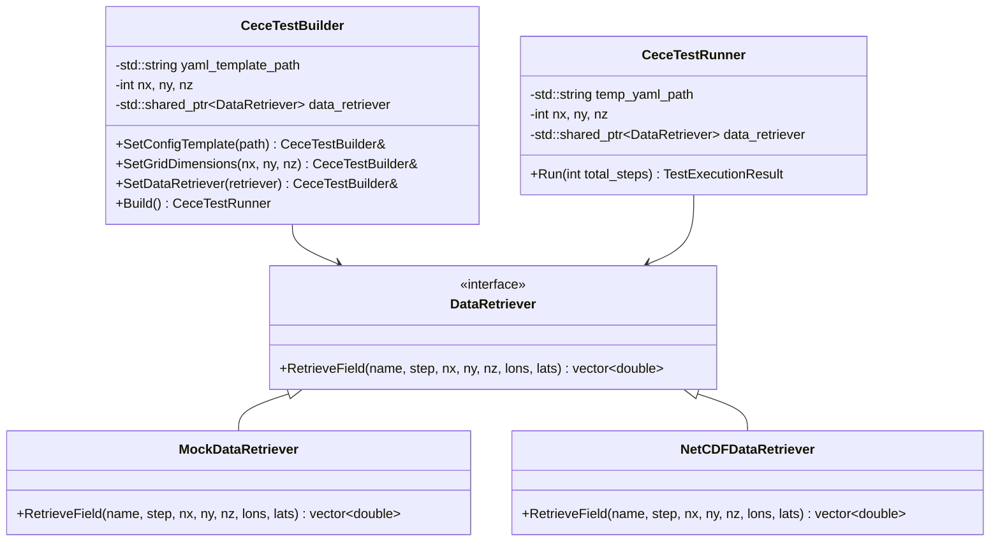

# CECE Integration Test Harness Design Specification

This document specifies the design for the end-to-end integration test harness for CECE, enabling execution using a YAML configuration entrypoint and verification of the outputs (in-memory and NetCDF file-based).

## 1. Objectives

- Run a CECE operation end-to-end using the YAML configuration entrypoints.
- Support both **Mocked** and **Integration** modes.
- Mock meteorological/import fields.
- Programmatically generate/modify YAML configurations using `yaml-cpp`.
- Verify output correctness in memory (`export_state` map) and on disk (NetCDF files).
- Follow a **Builder** design pattern to allow clean injection of synthetic generators and test custom configurations.

## 2. Architecture & Design Patterns

### 2.1 The Builder Pattern

To allow reuse of configurations and flexible injection of input data sources, we introduce the `CeceTestBuilder` pattern:



### 2.2 Input Data Injection

For the **Mocked** mode, we inject `MockDataRetriever`, which computes coordinate-dependent synthetic values:
$$\text{value} = \text{lat} + \text{lon} + \text{step}$$
This allows verifying that spatial indices and coordinate transformations are correctly tracked by the engine.

For the **Integration** mode, `NetCDFDataRetriever` defines the interface but throws `std::runtime_error`, since only the mocked mode is targeted for this milestone.

## 3. Detailed Interface Definition

### 3.1 DataRetriever Interface

```cpp
class DataRetriever {
public:
    virtual ~DataRetriever() = default;
    virtual std::vector<double> RetrieveField(
        const std::string& name,
        int step,
        int nx, int ny, int nz,
        const std::vector<double>& lons,
        const std::vector<double>& lats
    ) = 0;
};
```

### 3.2 MockDataRetriever Implementation

```cpp
class MockDataRetriever : public DataRetriever {
public:
    std::vector<double> RetrieveField(
        const std::string& name,
        int step,
        int nx, int ny, int nz,
        const std::vector<double>& lons,
        const std::vector<double>& lats
    ) override {
        std::vector<double> data(nx * ny * nz, 0.0);
        for (int k = 0; k < nz; ++k) {
            for (int j = 0; j < ny; ++j) {
                for (int i = 0; i < nx; ++i) {
                    double lon = lons[i];
                    double lat = lats[j];
                    int idx = k * (nx * ny) + j * nx + i;
                    data[idx] = lat + lon + static_cast<double>(step);
                }
            }
        }
        return data;
    }
};
```

### 3.3 Test Runner Lifecycle

The `CeceTestRunner` executes the following sequence:

1. **YAML generation:** Parse `examples/cece_config_ex1.yaml` using `yaml-cpp`, add/overwrite:
   - Grid dimensions (`nx`, `ny`, `nz`)
   - Start and end time, timestep
   - An `output` block to configure directory, filename pattern, fields, frequency
2. **Write config:** Save to a temporary location (e.g., `./temp_test_config.yaml`).
3. **Phase 1 Init:** Call `cece_set_config_file_path()` and `cece_core_initialize_p1()`.
4. **Phase 2 Init:** Call `cece_core_initialize_p2()`.
5. **Setup Coordinate Lists:** Generate standard grid longitude/latitude lists based on config bounds.
6. **Execution Loop:** For each timestep:
   - Call `data_retriever->RetrieveField` for any expected stream/import variables.
   - Cache synthetic inputs via `cece_ingestor_set_field()`.
   - Allocate and set/register export fields via `cece_core_set_export_field()`.
   - Call `cece_core_run()`.
   - Call `cece_core_write_step()` to trigger standalone output file generation.
7. **Verification:** Inspect the returned `export_state` and use the NetCDF C library (`netcdf.h`) to verify that the generated NetCDF files contain correct output values.
8. **Teardown:** Call `cece_core_finalize()` and delete temporary files.

## 4. Correctness Evaluation

Output correctness is evaluated at two levels:
1. **In-Memory Verification:** Validate values in the `CeceInternalData->export_state.fields` map directly.
2. **On-Disk netCDF Verification:** Load the generated NetCDF output file(s) using `<netcdf.h>` APIs, reading `time`, `lon`, `lat`, `lev`, and the export variable (`co`), asserting against the expected values.
